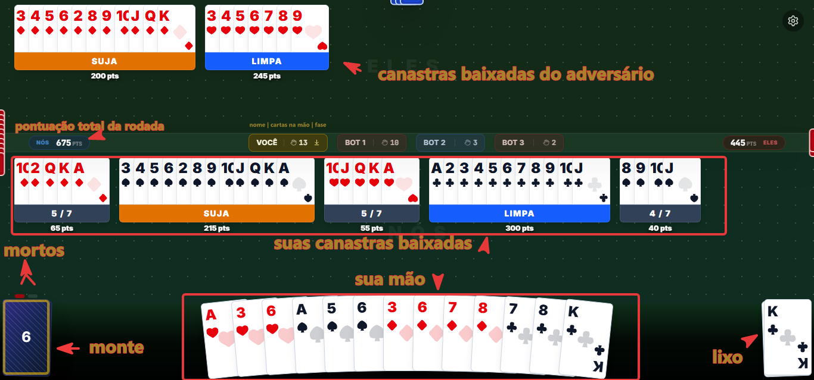

# Buraco Online

## Sobre o Projeto

Este projeto é uma implementação web do tradicional jogo de cartas **Buraco** (Canastra). Focado para quem quer jogar rápidamente seja com bots ou com amigos.

- **Modos de Jogo:** Suporta partidas em duplas (**2v2**).
- **Multiplayer & Bots:** É possível jogar online com amigos ou adicionar **Bots** com inteligência artificial para completar a mesa.
- **Regras Customizáveis:** No lobby da partida, o criador da sala pode personalizar algumas regras, como a condição de vitória (por limite de pontos ou número de rodadas) e o tempo por turno.
- **Design Responsivo:** Possível jogar em dispositivos móveis ou no computador.
- **Fácil acesso:** Sem login e instalações, basta um navegador.
- **Jogue Offline:** Pode instalar como PWA e jogar sem internet com bots.

---

## Como Jogar e Regras do Buraco

O jogo segue as regras do **Buraco Fechado**.

### Regras Básicas

- **Baralho:** Jogado com 2 baralhos franceses tradicionais (104 cartas no total).
- **Sequências:** Só valem **sequências do mesmo naipe** com no mínimo 3 cartas (ex: `4♥ 5♥ 6♥`). Não são permitidas trincas (cartas do mesmo valor de naipes diferentes) nem lavadeiras.
- **Curingas:** Os **8 "2s"** do baralho funcionam como curingas, podendo substituir qualquer carta na sequência.
- **Lixo Fechado:** Apenas a carta do topo do lixo fica visível.

### Fluxo do Turno

1. **Comprar:** Puxar 1 carta do monte **ou** pegar a carta do topo do lixo (somente se for usá-la imediatamente para baixar um novo jogo de 3+ cartas ou adicionar a um jogo existente na mesa).
2. **Baixar:** Formar novas sequências ou encaixar cartas nos jogos já baixados pela sua equipe.
3. **Descartar:** Jogar 1 carta no lixo para encerrar a vez.

### Pontuação (Você pode alterar)

- **Bônus de Canastras (7 ou mais cartas):**
  - **Canastra Suja (+100 pts):** Contém 1 curinga "2" fora de sua posição natural.
  - **Canastra Limpa (+200 pts):** Não contém nenhum curinga. _(Obrigatória pelo menos 1 limpa para bater o jogo)._
  - **Canastra de 500 (+500 pts):** 13 cartas consecutivas sem curinga (de Ás a Rei ou 2 a Ás).
  - **Canastra Real (+1.000 pts):** 14 cartas limpas de Ás (baixo) a Ás (alto).
  - **Batida (+100 pts):** Zerar as cartas da mão e pegar o morto. _(Multa de -100 pts caso a dupla não pegue o morto)._
- **Cada carta tem um valor de pontuação:**
  - A = 15 pontos
  - 8, 9, 10, J, Q, K = 10 pontos
  - 3, 4, 5, 6, 7 = 5 pontos
  - 2 = 20 pontos

---

## Interface de Usuário



## Como Hospedar o Próprio Jogo

Você pode rodar o jogo na sua máquina local ou hospedar num servidor para jogar com amigos.

### Pré-requisitos

- **Node.js** (v18+) ou **Bun** instalado.

### Rodando Localmente (Frontend + Backend Integrados)

1. Instale as dependências:

   ```bash
   npm install
   # ou com bun:
   bun install
   ```

2. Inicie o servidor em modo host:

   ```bash
   npm run host
   # ou com bun:
   bun run host
   ```

3. Acesse `http://localhost:3000` no seu navegador. Esse comando compila a aplicação e roda o backend e o frontend juntos na mesma porta.

---

### Jogando com Amigos (Túnel HTTPS Gratuito)

Se quiser liberar o acesso para amigos fora da sua rede local sem precisar configurar roteador:

1. Inicie o servidor local: `npm run host` (ou `bun run host`).
2. Em outro terminal, crie um túnel rápido usando Cloudflare ou Ngrok:
   ```bash
   npx cloudflared tunnel --url http://localhost:3000
   # ou
   ngrok http 3000
   ```
3. Envie o link HTTPS gerado aos seus amigos.

---

### Hospedando 24/7 na Nuvem (Render, Docker ou VPS)

Para manter o jogo rodando direto num serviço como o **Render**:

- **Build Command:** `npm install && npm run build && cd server && npm install`
- **Start Command:** `cd server && npm run server:dist`
- _(Opcional)_ Se decidir hospedar o Frontend e o Backend em servidores/domínios totalmente separados, defina a variável de ambiente no Frontend:
  `VITE_SERVER_URL=https://url-do-seu-backend.com` (veja `.env.example`).

---

## 4. Tecnologias e Arquitetura do Projeto

### Stack Utilizada

- **Frontend:** React 19, Vite, TailwindCSS, Framer Motion, Zustand.
- **Backend:** Node.js / Bun, Express, Socket.IO.
- **Linguagem:** TypeScript.

### Arquitetura do Código

```text
├── common/              # Lógica compartilhada entre Frontend e Backend
│   ├── types/           # Interfaces de Cartas, Jogadores e Regras
│   └── utils/           # Algoritmos de pontuação e validação de sequências
│
├── server/              # Backend autoritativo do jogo
│   ├── controllers/     # Handlers de Socket.io (gerenciamento de salas e turnos)
│   ├── services/        # Lógica dos Bots e inteligência artificial
│   ├── state.ts         # Armazenamento e gerenciamento do estado em memória
│   ├── index.ts         # Servidor de desenvolvimento (porta 3050)
│   └── server_dist.ts   # Servidor de produção estático + WebSockets (porta 3000)
│
└── src/                 # Frontend (Client Web)
    ├── components/      # Componentes UI (Mesa, Mão, Lixo, Animações, Placar)
    ├── store/           # Gerenciamento de estado global com Zustand e Socket.io
    └── hooks/           # Hooks utilitários e efeitos sonoros
```
